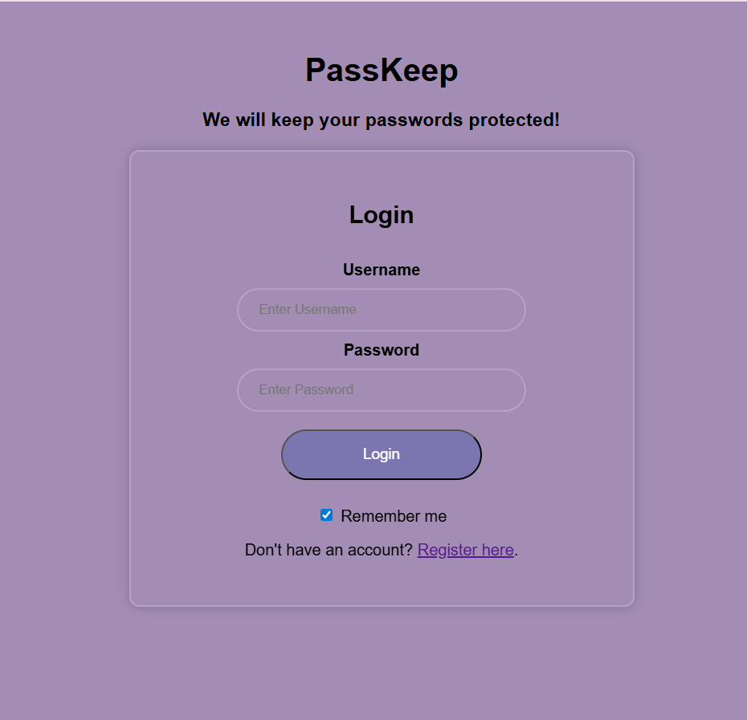
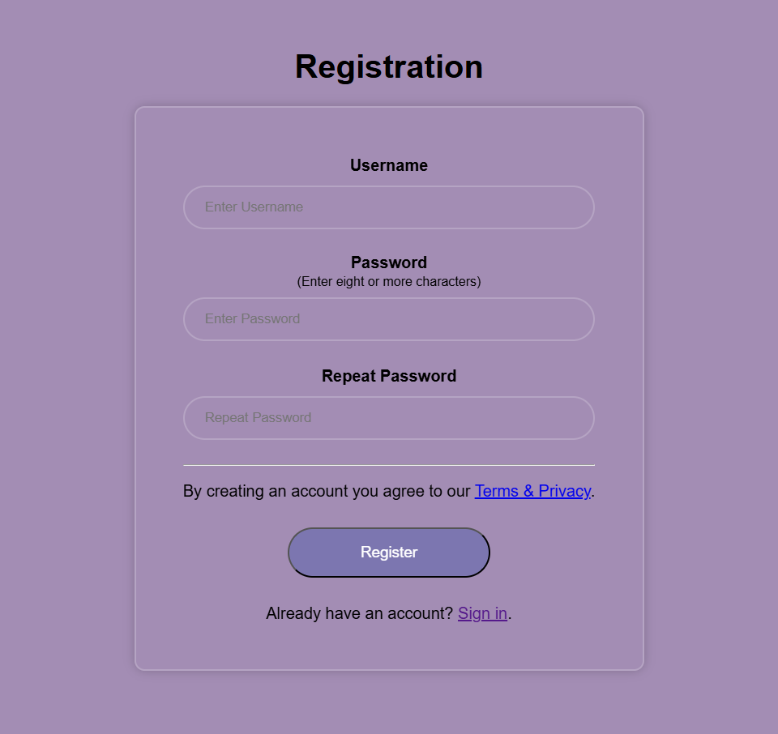
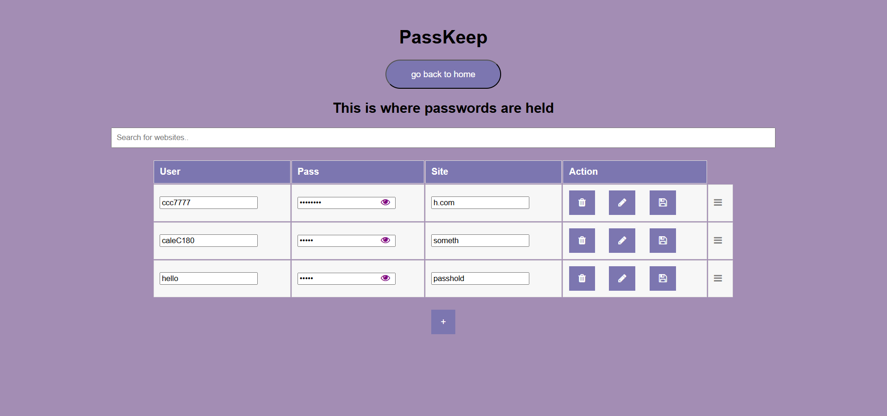

# PassKeep
A full-stack password manager web app with encryption, user authentication, and MongoDB integration.  

# Features
- User authentication (register/login system)
- Add, edit, and delete password entries
- Local encryption for password storage
- Draggable rows with saved order
- MongoDB database with unique row IDs
- Responsive, modern UI built with HTML/CSS/JavaScript

# Tech Stack
- **Frontend**: HTML, CSS, JavaScript  
- **Backend**: Node.js, Express  
- **Database**: MongoDB  
- **Other**: LocalStorage, bcrypt (for encryption)

## Screenshots

### Login Page


### Registration Page


### Password Table



## Getting Started
1. Clone the repository  
   ```bash
   git clone https://github.com/your-username/passkeep.git
   cd passkeep

2. Setup  backend
   ```bash
   cd backend
   npm install
   npm start

3. Setup  backend
   ```bash
   cd frontend
   npm install
   npm start


4. Configure environment variables (create a .env file in /backend):
    ```bash
   MONGO_URI=your-mongodb-connection-string
   PORT=5000
   ```

## Project Structure
    ```bash
    PassKeep/
    ├── frontend/          # Client-side code (HTML/CSS/JS)
    │   ├── index.html
    │   ├── passHold.html
    │   └── register.html
    ├── backend/           # Server-side code (Node.js + Express + MongoDB)
    │   ├── models/
    │   │   ├── PasswordEntry.js
    │   │   └── User.js
    │   ├── node_modules/
    │   ├── .env (ignored)
    │   ├── test.js
    │   ├── server.js
    │   ├── package-lock.json
    │   ├── package.json
    │   └── .gitignore
    ├── screenshots/       # Images used in the README
    └── README.md          # Project documentation
    ```   

       
## Author
Caleb Conwell